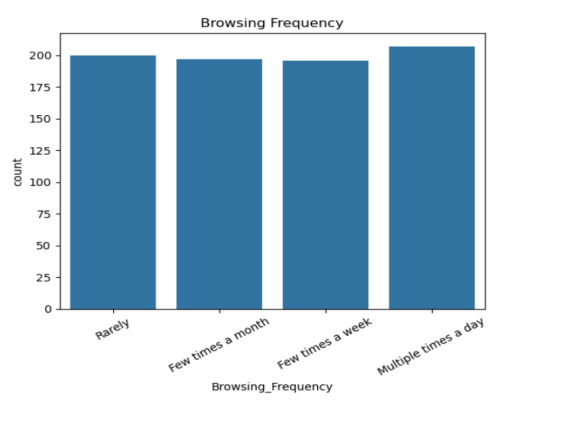
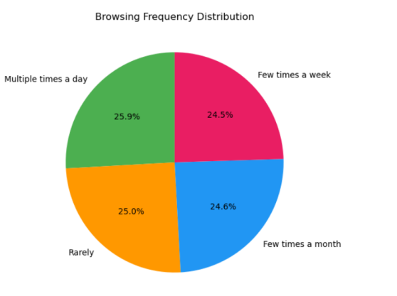
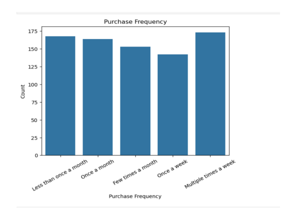
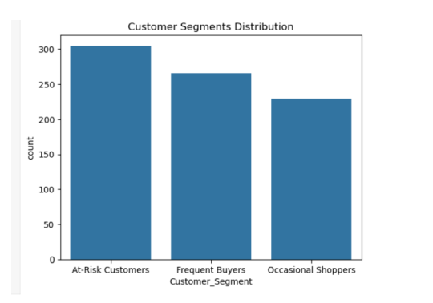
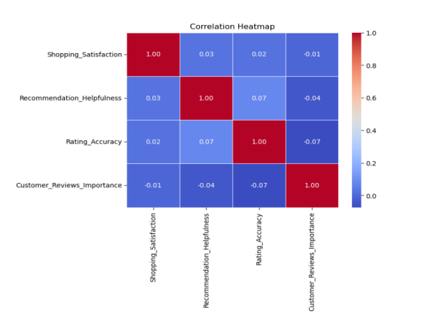
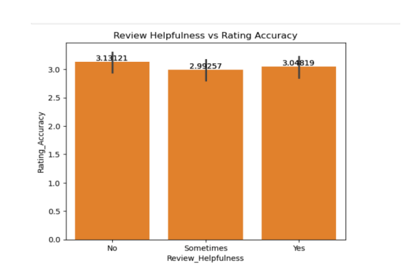

# 🛒 Market Basket Analysis – TARGET  
### Python | Machine Learning | Customer Behavior Analytics  

📍 Data Analytics Project | Recommendation System | Customer Insights  

---

## 📌 Project Overview

This project analyzes customer shopping behavior to identify **purchase patterns, product affinities, and customer segments** using Python and ML techniques.

The goal: **Improve personalized recommendations, cross-selling, and customer engagement.**

---

## 📊 Key Analysis Areas

✔ Data Cleaning & Preprocessing  
✔ Purchase & Browsing Behavior Analysis  
✔ Customer Segmentation (K-Means)  
✔ Recommendation & Review Insights  
✔ Correlation Analysis  
✔ Behavioral Pattern Identification  

---

## 📈 Major Insights

- Customer engagement is moderate and evenly distributed  
- Majority of users fall under **At-Risk segment**  
- Recommendations have **limited impact on satisfaction**  
- Weak correlation between ratings, reviews & satisfaction  
- High opportunity for **personalization & UX improvement** :contentReference[oaicite:1]{index=1}  

---

## 📷 Visual Insights

### 🌐 Browsing Frequency

- Users show consistent engagement across all levels  

---

### 🥧 Browsing Distribution

- Almost equal distribution across browsing categories  

---

### 📊 Purchase Frequency

- Mix of frequent and occasional buyers  

---

### 👥 Customer Segmentation

- At-Risk customers dominate  
- Frequent buyers show strong engagement  

---

### 🔍 Correlation Heatmap

- Weak relationship between satisfaction & other factors  

---

### ⭐ Review Impact

- Minimal impact of reviews on rating accuracy  

---

## 🛠 Tools Used

- Python  
- Pandas & NumPy  
- Matplotlib & Seaborn  
- Scikit-learn (K-Means Clustering)  
- Data Cleaning & EDA  

---

## 🚀 Business Recommendations

- Improve **personalized recommendation systems**  
- Focus on converting **At-Risk customers**  
- Enhance **user experience & service quality**  
- Reduce cart abandonment factors (pricing, UX)  

---

## 🎯 Business Impact

This project helps in:

- Improving recommendation accuracy  
- Increasing customer engagement  
- Identifying high-value & at-risk customers  
- Enabling data-driven marketing strategies  

---

## 📁 Repository Structure

Market-Basket-Analysis/
│  
├── screenshots/  
│   ├── browsing_freq.png  
│   ├── browsing_freq_pie.png  
│   ├── purchase_freq.png  
│   ├── customer_segmentation.png  
│   ├── correlation.png  
│   └── review_helpfulness.png  
│  
├── dataset  
├── python scripts  
└── README.md  
